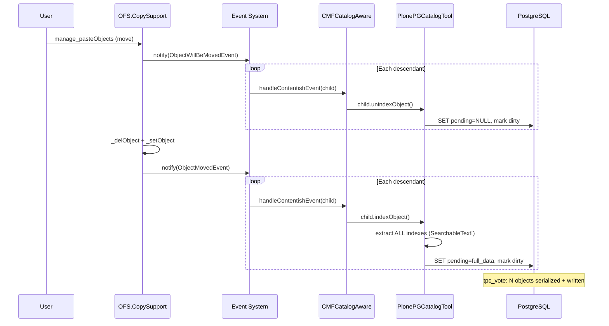
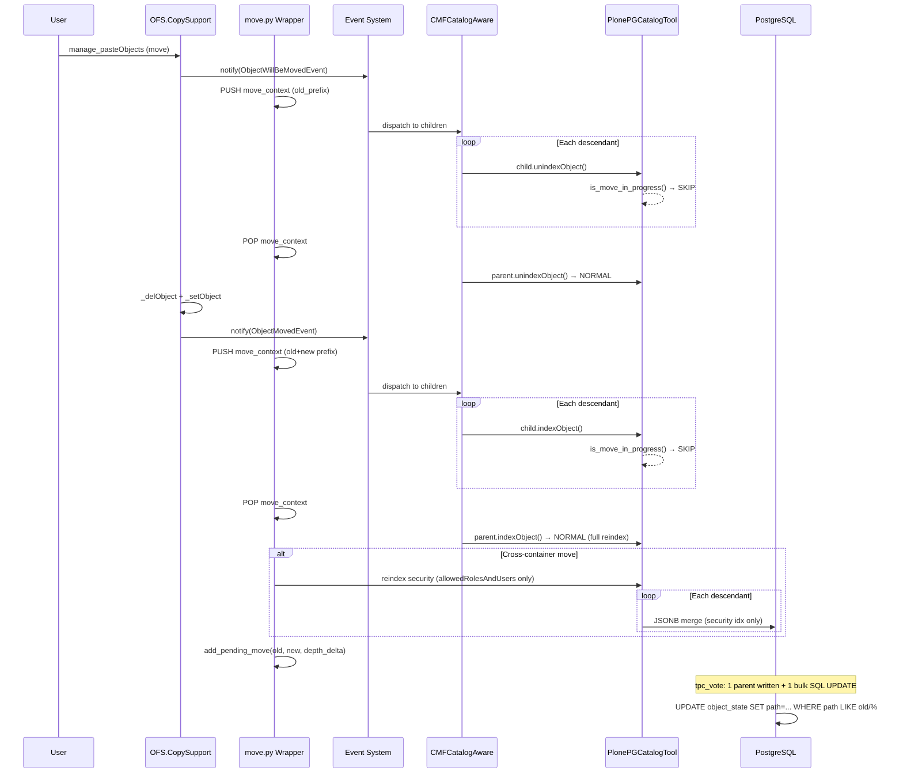

# Move/Rename Optimization

## Problem

Moving or renaming a folder in Plone triggers expensive per-child reindexing.
When OFS fires `IObjectMovedEvent`, `dispatchToSublocations` recursively fires the
same event on **every descendant**.  CMFCore's `handleContentishEvent` then calls
`unindexObject()` followed by `indexObject()` on each child — extracting ALL indexes
(including expensive `SearchableText`) and marking each child `_p_changed=True`.

For a folder with 1,000 items this means:
- 1,000 × `unindexObject()` calls (each NULLing catalog columns)
- 1,000 × `indexObject()` calls (each extracting all indexes, computing SearchableText)
- 1,000 objects marked `_p_changed` → serialized in ZODB `tpc_vote`

A move only changes **paths**, not content.  With `plone-pgcatalog`, path data lives
in SQL columns — a single `UPDATE ... WHERE path LIKE old_prefix || '/%'` fixes all
descendants in one statement.

## Solution

Replace per-child Python reindex with a single bulk SQL path `UPDATE`.

### Key components

| File | Purpose |
|------|---------|
| `move.py` | Move context stack, OFS handler wrappers, security reindex |
| `pending.py` | `pending_moves` store (thread-local, transaction-aware) |
| `catalog.py` | `indexObject`/`unindexObject` skip during moves |
| `processor.py` | Bulk SQL `UPDATE` in `finalize()` |
| `startup.py` | Installs handler wrappers at Zope startup |

### How it works

1. **At startup**, `install_move_handlers()` replaces OFS's event dispatch handlers
   with wrappers that set a thread-local "move in progress" flag.

2. **During a move**, the wrapper detects that `ob is event.object` (the root of the
   move) and pushes a `MoveContext` onto a thread-local stack.

3. **While the flag is set**, `indexObject()` and `unindexObject()` on the catalog
   return immediately — children are not reindexed or uncataloged.

4. **After OFS dispatch completes**, the wrapper pops the context and registers a
   `pending_move` entry: `(old_prefix, new_prefix, depth_delta)`.

5. **In `processor.finalize()`** (same PG transaction as ZODB commit), the pending
   moves are popped and executed as single SQL `UPDATE` statements.

6. **For cross-container moves** (`oldParent is not newParent`), a targeted
   security-only reindex updates `allowedRolesAndUsers` for descendants.

## Sequence Diagrams

### Current (slow) move flow



### Optimized move flow



## The Bulk SQL

The core optimization is a single SQL statement per moved subtree:

```sql
UPDATE object_state SET
    path = new_prefix || substring(path FROM length(old_prefix) + 1),
    parent_path = new_prefix || substring(parent_path FROM length(old_prefix) + 1),
    path_depth = path_depth + depth_delta,
    idx = idx || jsonb_build_object(
        'path',
        new_prefix || substring(idx->>'path' FROM length(old_prefix) + 1),
        'path_parent',
        new_prefix || substring(idx->>'path_parent' FROM length(old_prefix) + 1),
        'path_depth',
        (idx->>'path_depth')::int + depth_delta
    )
WHERE path LIKE old_prefix || '/%'
  AND idx IS NOT NULL
```

This updates:
- `path` — the physical path column
- `parent_path` — the parent path column
- `path_depth` — the depth column (adjusted by delta for cross-level moves)
- `idx` JSONB — the `path`, `path_parent`, and `path_depth` keys inside idx

The `WHERE path LIKE old_prefix || '/%'` clause ensures:
- Only **descendants** are updated (the trailing `/%` excludes the parent itself)
- Siblings and other subtrees are untouched
- The parent's own path is updated through the normal `indexObject()` pipeline

## Edge Cases

### Rename (same container)
`depth_delta=0`.  Old and new prefix differ only in the last segment.
Example: `/plone/source` → `/plone/source-renamed`.

### Cross-container move
`depth_delta != 0`.  All descendants shift depth.
Example: `/plone/source` → `/plone/target/source` (`depth_delta=+1`).

### Move up
Negative `depth_delta`.
Example: `/plone/source/sub` → `/plone/sub` (`depth_delta=-1`).

### Empty folder
The `UPDATE` matches 0 rows.  No error, no effect.

### Bulk rename (multiple items in one transaction)
Each rename fires events sequentially (Plone's `manage_renameObjects` loops).
Each generates a separate `pending_move` entry.  In `finalize()`, all UPDATEs
execute in event order.  Non-overlapping `WHERE` clauses — correct.

### Nested moves (move subtree inside a larger move)
Example: rename `/plone/folder/sub1`, then move `/plone/folder`.
Two `pending_move` entries accumulate.  `finalize()` executes in order:
1. First UPDATE fixes sub1's children (old prefix → new within folder)
2. Second UPDATE fixes everything under `/plone/folder/` including already-renamed sub1

### Delete (not a move)
`event.newParent is None` — wrappers pass through, no optimization applied.

### Copy
Fires `IObjectCopiedEvent`/`IObjectClonedEvent`, not `IObjectMovedEvent` — unaffected.

### Non-pgcatalog sites
`_is_pgcatalog_active()` returns `False` — wrappers pass through transparently.

## Security Reindex

For cross-container moves (`oldParent is not newParent`), descendants may inherit
different permissions from the new parent.  The optimization performs a targeted
security-only reindex:

- Only `allowedRolesAndUsers` is extracted (one index, not all)
- Uses `_partial_reindex` → lightweight JSONB merge
- No `_p_changed`, no ZODB serialization
- Objects are likely already in ZODB cache from OFS dispatch

Renames within the same container (`oldParent is newParent`) skip security reindex
entirely — the parent chain hasn't changed.

## History-Preserving Mode

The optimization works identically in history-free (HF) and history-preserving (HP)
modes:

- Catalog columns (`path`, `parent_path`, `path_depth`, `idx`) live only on
  `object_state`.  `object_history` stores only base ZODB columns.
- Children don't get new TIDs — their ZODB state (pickle) hasn't changed.
- The parent **does** get a new TID — its `_objects` dict genuinely changed.

## Undo

`ZODB.undo()` operates at storage level only — no OFS events fire.  After undo
of a move, catalog columns are stale (still show post-move paths).  A catalog
rebuild is needed — this is the same behavior as the current system without
the optimization.

## Expected Impact

| Metric | Current | Optimized |
|--------|---------|-----------|
| Python calls per child | 2 (unindex + index) | 0 (skipped) |
| Index extraction | ALL indexes per child | 0 (or security only for cross-container) |
| ZODB serialization | N children marked dirty | 1 parent only |
| SQL statements | 2N (N NULL + N full) | 1 bulk UPDATE |
